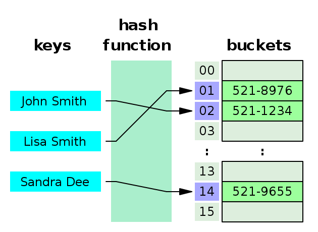
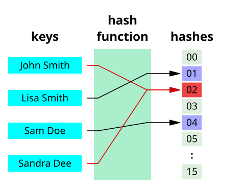
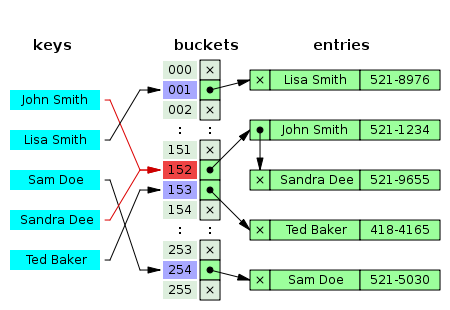

# Hash

## Hash Function
- 임의의 길이를 갖는 임의의 데이터를 고정된 길이의 데이터로 매핑하는 단방향 함수
- Key를 고정된 길이의 hash로 변경(이 과정을 hashing)해주는 역할
- 데이터를 저장하는 해시 테이블, 해시맵, 암호확, 데이터 무결성 검증에 사용
- 종류는 Division method, MD5, SHA 등이 존재
- 입력값은 무한하지만 출력값은 유한하므오 서로 다른 입력값에도 동일한 값이 출력되는 경우도 존재 -> Hash Collision(해시 충돌)

### Hash Collision(해시 충돌) 해결법
- Separate Chaining(줄여서 Chaining이라고 부름)
  - bucket 내에 Linked List를 할당하여 충돌이 발생하는 경우 데이터를 Linked List로 연결하는 방식
    - Java의 HashMap의 경우에서는 버킷이 8개 이상되면 Linked List에서 Tree로 구조 변경, 다시 6개에 도달하면 Tree에서 Linked List로 변경
  - 최악의 경우 O(N)으로 성능 저하가 발생
  
- 개방 주소법(Open Addressing)
  - 해시 충돌이 일어나면 다른 버켓에 데이터를 삽입하는 방식
  - 체이닝처럼 포인터 및 지정한 메모리 외 추가적인 저장공간 불필요
  - 삽입,삭제 시 낮은 오버헤드
  - 적은 데이터에 유리

  - 종류
    - 선형 탐색(Linear Probing)
      - 해시충돌 시 다음 버켓, 혹은 몇 개를 건너뛰어 데이터를 삽입
    - 제곱 탐색(Quadratic Probing)
      - 해시충돌 시 제곱만큼 건너뛴 버켓에 데이터를 삽입
    - 이중 해시(Double Hasing)
      - 해시충돌 시 다른 해시함수를 한 번 더 적용한 결과를 이용

### Hash Function 종류
- Division method
  - 가장 기본적인 해시 함수
  - 숫자로 된 키를 해시테이블 크기 m으로 나눈 나머지로 매핑
- Multiplication method
  - 2진수 연산에 최적화된 컴퓨터구조를 고려한 해시함수
  - 숫자로 된 Key값 K와 0과 1사이의 실수 A, 보통 2의 제곱수인 m을 사용하며 `h(k) = ( kA mod 1 ) × m` 으로 계산
- Univeral hasing
  - 여러개의 해시함수를 만들고, 이 해사함수의 집합 H에서 무작위로 해시함수를 선택해 해시값을 만드는 기법
  - 서로 다른 해시함수가 서로 다른 해시값을 만들어내기 때문에 같은 공간에 매핑할 확률을 줄이는 것이 목적
- 암호학 해시 함수
  - MD5(Message Digest algorithm 5)
    - 128비트 암호화 해시
    - 무결성 검사 등에 사용
  - SHA(Secure Hash Algorithm)
    - 데이터의 무결성을 보장하기 위해 널리 사용되는 암호학적 해시 함수
    - 버전은 SHA-0, SHA-1, SHA-2, SHA-3이 존재하며 SHA-256과 SHA-512는 SHA-2에 기반한 해시 함수
    - 디지털 서명, 파일 검증, 보안 프로그램에 사용

## 안전한 해시함수
1. 역상 저항성
해시 값을 생성하는 입력값을 찾는 것이 계산상 어려워야한다.

2. 제 2역상 저항성
 동일한 해시값(y)이 나오는 다른 입력값(x')을 찾는 것은 계산적으로 불가능해야한다.

3. 충돌 저항성
 동일한 해시 값이 나와서는 안된다.

## SHA
### SHA-0 & SHA-1
- 주어진 데이터를 160비트(20바이트) 길이의 고유한 해시값으로 변환
- **충돌쌍 문제**(두 데이터에 대한 해시를 계산하였더니 같은 결과값이 도출되는 문제)로 인하여 현재 사용을 권장 X
- Git에서는 SHA-1을 기존에는 사용하였으나 권장하지 않고 SHA-2를 권장

### SHA-2
- 수학적으로는 충돌 가능성이 존재하지만 공학적으로는 그 가능성은 없다고 봐도 무방
- SHA-256
  - 현재 블록체인에서 가장 많이 채택하여 사용되고 있는 암호 방식
  - SHA-512보다 훨씬 빠르게 64개의 해시 생성
  - 안정성 문제에서도 큰 단점이 발견되지 않음
  - 256 비트(bits)의 축약된 메시지
  - 속도가 빠름
  - 보안성: 256비트의 해시 값은 충돌 저항성이 높아 동일한 해시 값을 갖는 두 개의 다른 입력을 찾을 가능성 희박
  - 사용처: 디지털 서명, 암호화폐 트랜잭션 해시 생성, 데이터 무결성 검증 등에 사용
- SHA-512
  - 512비트(64바이트) 해시 값을 생성
  - 길이 확장 공격에 대해 취약
  - 결과 값이 512비트로만 나와서 용량을 많이 차지
  - 보안성: 512비트 해시는 더 높은 보안을 제공하며, 큰 데이터 세트를 효율적
  - 사용처: 고성능 컴퓨팅 요구 사항, 대용량 데이터 처리, 정부 기관 및 금융기관에서의 고급 암호화 필요 영역 등에서 사용

### SHA-3
- SHA-2가 출력할 수 있는 메시지 해시값의 크기를 모두 출력
- 충돌 저항성, 역상 저항성, 제2역상 저항성을 모두 갖춤
- SHA-2가 사용되는 곳에 SHA-3를 바로 적용 가능
- 높은 수준의 병렬 구조를 가지고 메모리 접근해서 효율성이 아주 좋음
- 단점으로는 지원하는 소프트웨어 및 하드웨어의 부재, 느린 속도

## Reference
- https://en.wikipedia.org/wiki/Hash_function
- https://power-overwhelming.tistory.com/42
- https://k0102575.github.io/articles/2020-03/hash
- https://velog.io/@gkfla668/Git-Commit-ID%EB%A5%BC-Hash%EB%A1%9C-%EA%B4%80%EB%A6%AC%ED%95%98%EB%8A%94-%EC%9D%B4%EC%9C%A0%EB%8A%94-%EB%AC%B4%EC%97%87%EC%9D%BC%EA%B9%8C
- https://velog.io/@ragi/Back-end-MD5%EC%99%80-SHA%EC%9D%98-%EC%B0%A8%EC%9D%B4
- https://velog.io/@cyranocoding/Hash-Hashing-Hash-Table%ED%95%B4%EC%8B%9C-%ED%95%B4%EC%8B%B1-%ED%95%B4%EC%8B%9C%ED%85%8C%EC%9D%B4%EB%B8%94-%EC%9E%90%EB%A3%8C%EA%B5%AC%EC%A1%B0%EC%9D%98-%EC%9D%B4%ED%95%B4-6ijyonph6o
- https://namu.wiki/w/SHA
- https://egg-stone.tistory.com/19
- https://swingswing.tistory.com/169
- [go 내부적으로는 map을 어떻게 구현했을까](https://blog.frec.kr/golang/go-hashtable-0/)