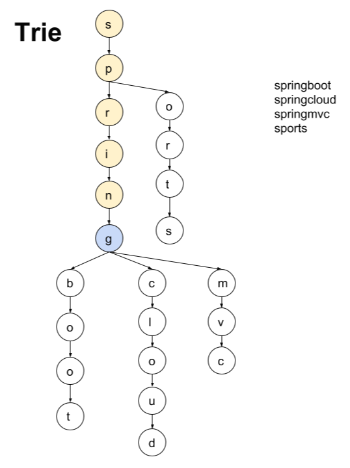
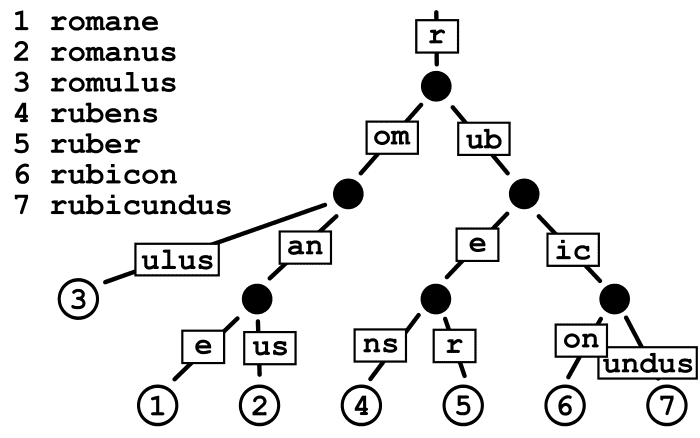
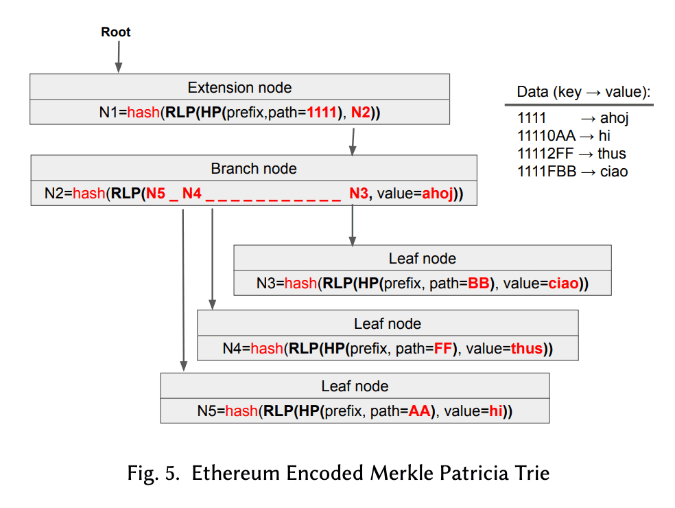

# Trie

- 주로 문자열을 저장하고 효율적으로 탐색하기 위한 트리(Tree) 형태의 자료구조
- Prefix Tree, digital search tree, retrieval tree라고도 부릅니다.
- 문자열이 키인 경우가 흔하지만 필수는 아닙니다.
- 삽입, 삭제, 탐색에 대하여 시간복잡도는 O(L)입니다. L은 입력값의 길이입니다.
- 일반적으로 문자열 탐색하는 알고리즘보다 효율적입니다.
- 문자열 탑색 알고리즘으로는 KMP가 존재합니다.
- 데이터 저장을 하기 위해 node를 생성하기에 메모리 효율성이 떨어질 수 있습니다. 그리하여 map을 이용하여 좀더 효율적으로 변경하는 경우도 있습니다.
- 일반적으로 대용량의 데이터를 저장하고 탐색을 위해 많이 사용합니다.

## 구현
```go
package main

import (
	"fmt"
	"sync"
)

type node struct {
	children map[string]*node
	isLast   bool
}

type Trie struct {
	root *node
	*sync.RWMutex
}

func newNode() *node {
	return &node{
		children: make(map[string]*node),
		isLast:   false,
	}
}

func NewTrie() Trie {
	rootNode := &node{
		children: make(map[string]*node),
		isLast:   true,
	}

	return Trie{
		root:    rootNode,
		RWMutex: &sync.RWMutex{},
	}
}

func (t *Trie) Insert(str string) {
	t.Lock()
	defer t.Unlock()

	head := t.root
	t.root.isLast = false

	for index := range str {

		char := string(str[index])
		if _, exists := head.children[char]; !exists {
			head.children[char] = newNode()
		}

		head = head.children[char]
	}

	head.isLast = true
}

func (t Trie) Search(str string) bool {
	t.RLock()
	defer t.RUnlock()

	head := t.root

	for index := range str {
		char := string(str[index])
		if head.children[char] == nil {
			return false
		}

		head = head.children[char]
	}

	return head.isLast
}

func (t *Trie) Delete(str string) {
	t.Lock()
	defer t.Unlock()

	delete(t.root, str, 0)
}

func delete(head *node, str string, depth int) (isDeleted, isEmpty bool) {
	if depth == len(str) {
		if head.isLast {
			head.isLast = false
		}

		if len(head.children) == 0 {
			return true, true
		}

		return true, false
	}

	char := string(str[depth])
	if child := head.children[char]; child != nil {
		isDeleted, isEmpty = delete(child, str, depth+1)
		if isDeleted && isEmpty {
			head.children[char] = nil
		}

		isEmpty = len(head.children) == 0
	}

	return
}

func main() {
	strings := []string{"hello", "hi", "here", "fjdsngfjasd"}

	trie := NewTrie()
	for _, str := range strings {
		trie.Insert(str)
	}

	fmt.Println(trie.Search("h")) // false
	fmt.Println(trie.Search(""))  // false
	fmt.Println("---------------")

	fmt.Println(trie.Search("hello"))       // true
	fmt.Println(trie.Search("hi"))          // true
	fmt.Println(trie.Search("here"))        // true
	fmt.Println(trie.Search("fjdsngfjasd")) // true
	fmt.Println("---------------")

	trie.Delete("hello")
	fmt.Println(trie.Search("hello"))       // false
	fmt.Println(trie.Search("hi"))          // true
	fmt.Println(trie.Search("here"))        // true
	fmt.Println(trie.Search("fjdsngfjasd")) // true
	fmt.Println("---------------")

	trie.Delete("fjdsngfjasd")
	fmt.Println(trie.Search("hello"))       // false
	fmt.Println(trie.Search("hi"))          // true
	fmt.Println(trie.Search("here"))        // true
	fmt.Println(trie.Search("fjdsngfjasd")) // false
	fmt.Println("---------------")

	trie.Delete("hi")
	fmt.Println(trie.Search("hello"))       // false
	fmt.Println(trie.Search("hi"))          // false
	fmt.Println(trie.Search("here"))        // true
	fmt.Println(trie.Search("fjdsngfjasd")) // false
	fmt.Println("---------------")

	trie.Delete("here")
	fmt.Println(trie.Search("hello"))       // false
	fmt.Println(trie.Search("hi"))          // false
	fmt.Println(trie.Search("here"))        // false
	fmt.Println(trie.Search("fjdsngfjasd")) // false
	fmt.Println("---------------")

	trie.Delete("here")
	fmt.Println(trie.Search("hello"))       // false
	fmt.Println(trie.Search("hi"))          // false
	fmt.Println(trie.Search("here"))        // false
	fmt.Println(trie.Search("fjdsngfjasd")) // false
	fmt.Println("---------------")

	fmt.Println(trie.Search("hello"))       // false
	fmt.Println(trie.Search("hi"))          // false
	fmt.Println(trie.Search("here"))        // false
	fmt.Println(trie.Search("fjdsngfjasd")) // false
}
```

## Patricia Trie

- 패트리샤 트라이는 트라이의 메모리 효율을 개선한 데이터 구조로, `경로 압축(Path Compression)`을 통해 메모리 사용량을 줄입니다. 이미지와 같이 공통 접두사를 가진 키들이 한 노드에서 표현될 수 있습니다.

- 트라이와 비교했을 때, 패트리샤 트라이는 키의 공통 접두사를 공유하는 데이터를 효율적으로 관리할 수 있습니다. 트라이의 단점인 메모리 사용량을 크게 줄이면서도 트라이의 장점인 효율적인 검색 속도를 유지합니다.


## Merkle Patricia Trie(MPT)

- Patricia Trie는 키의 공통 접두사를 기반으로 데이터를 효율적으로 저장하고 검색할 수 있는 데이터 구조입니다. Merkle Tree는 데이터 무결성 검증에 유용한 구조이지만, 키 기반의 검색과 데이터 저장 효율성 측면에서는 Patricia Trie만큼 효율적이지 않습니다.
- MPT는 이 두 구조의 장점을 합친 것으로, Patricia Trie의 효율적인 키 관리 및 검색 능력과 Merkle Tree의 강력한 데이터 무결성 검증 기능을 결합합니다. 이를 통해, 이더리움은 분산 환경에서도 빠르고 안정적으로 데이터를 관리할 수 있게 되었습니다.


## Refernece
- https://en.wikipedia.org/wiki/Trie
- https://velog.io/@kimdukbae/%EC%9E%90%EB%A3%8C%EA%B5%AC%EC%A1%B0-%ED%8A%B8%EB%9D%BC%EC%9D%B4-Trie
- https://medium.com/@itachisasuke/implementing-a-search-engine-in-golang-trie-data-structure-c45152ddda24
- https://devkly.com/blockchain/ethereum-state/
- https://ethereum.stackexchange.com/questions/6415/eli5-how-does-a-merkle-patricia-trie-tree-work